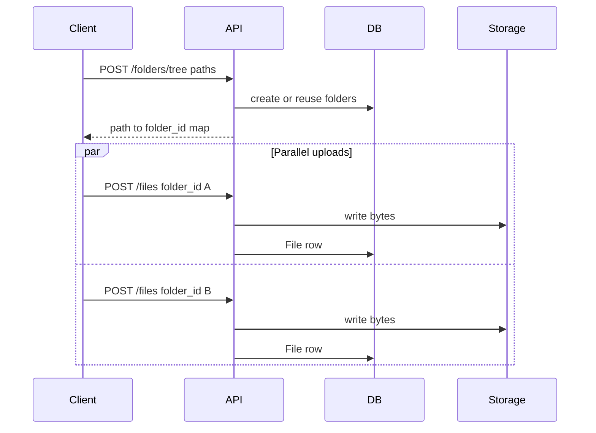

# Scalable folder upload

## Why not one request

A Drive-style folder can be thousands of files. Putting them in one multipart/zip request would:

- Pin one Node process and one TCP connection for the whole tree
- Blow request timeouts and RAM
- Make retries all-or-nothing
- Fight the future S3/R2 path (bytes should not go through this API)

Keep **metadata** (folders) and **bytes** (files) separate.



The client walks `webkitRelativePath` (or equivalent), calls tree once, then uploads files with a small concurrency limit (e.g. 4–8). Failed files retry independently.

## API

**`POST /api/folders/tree`** (auth required)

Body:

```json
{
  "parent_id": null,
  "paths": ["Photos", "Photos/2024", "Docs/invoices"]
}
```

- `parent_id`: destination folder, or `null` for root (same as create folder)
- `paths`: relative folder paths, `/`-separated, no leading slash
- Empty folders are first-class: a path with no files still creates the folder
- **Idempotent:** existing owned, non-trashed folders with the same name under the same parent are reused
- Response: `{ "folders": { "Photos": "<id>", "Photos/2024": "<id>", "Docs": "<id>", "Docs/invoices": "<id>" } }`

Then reuse **`POST /api/files`** with `folder_id` from that map. No new file-upload endpoint.

## Validation and limits (high traffic)

In [`src/validators/folder.validator.ts`](src/validators/folder.validator.ts):

- Max **200** paths per request
- Max **20** segments per path
- Segment: trim, 1–255 chars, reject `.` `..` empty `\` control chars
- Deduplicate paths after normalize
- Implicit parents: `a/b/c` also ensures `a` and `a/b` (count those toward the 200 cap after expansion)

Reject the whole request if limits fail (400). Do not start creating.

## Service / repository

Add `ensureFolderTree(ownerId, parentId, paths)` in [`src/services/folder.service.ts`](src/services/folder.service.ts):

1. Verify `parent_id` is owned and not trashed (same as create).
2. Expand paths to unique prefixes, sort by depth.
3. Walk depth-first in **one Prisma transaction**.
4. Per segment: look up `(owner_id, parent_id, name, deleted_at: null)`; create if missing.
5. On unique conflict (`P2002`), re-read the existing row (two clients creating the same tree).

Repository additions in [`src/repositories/folder.repository.ts`](src/repositories/folder.repository.ts):

- `findOwnedByParentAndName(ownerId, parentId, name)`
- Keep using existing `create`

Do not use `createMany` without returning IDs; we need the map.

Controller/route/OpenAPI follow existing folder patterns in [`src/routes/folder.routes.ts`](src/routes/folder.routes.ts) and [`src/docs/openapi.ts`](src/docs/openapi.ts). Register **`POST /tree` before `/:id`** so it is not captured as an id.

## What we will not build now

- Zip unpack on the server
- `multer.array()` / one request with N files
- Background jobs / queues (the split above is enough until S3)
- Changing `IObjectStorage` (folder tree is DB-only)

## Later (S3 / R2)

Same `POST /folders/tree`. File bytes move to presigned PUT; this API only writes `File` rows. Controller/tree logic does not change.

## Client contract (document in OpenAPI description)

- Concurrency 4–8 uploads
- Retry a single failed `POST /files`
- Skip or rename on `409` name conflict in a folder

## Partial failure handling

`POST /folders/tree` is atomic — all folders are created in one transaction or none are.
Each `POST /files` is independent. If some uploads fail:

- **Retry** only the failed files using the same `folder_id` from the tree map
- Folders are **not** rolled back on partial file failure — empty folders are valid
- If the user cancels, call `PATCH /folders/trash` to clean up unwanted empty folders
